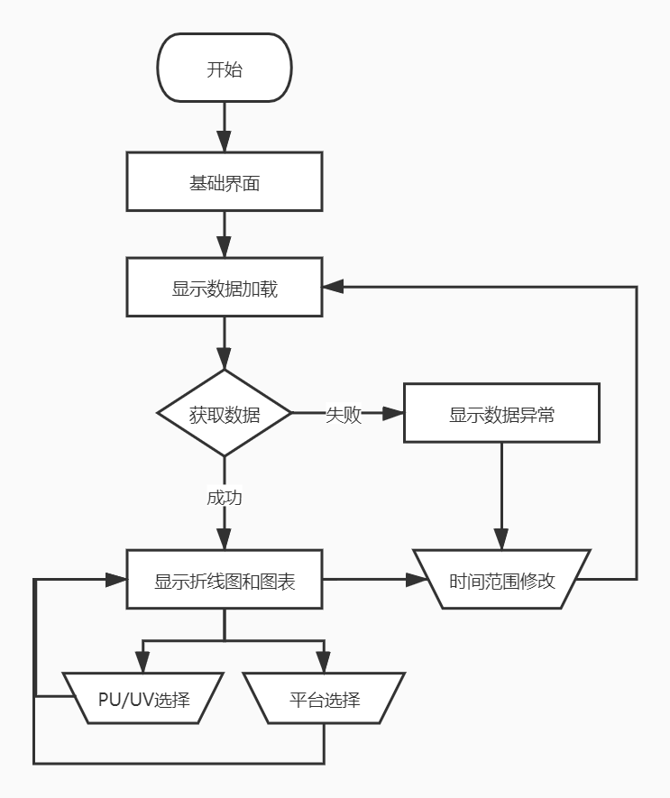
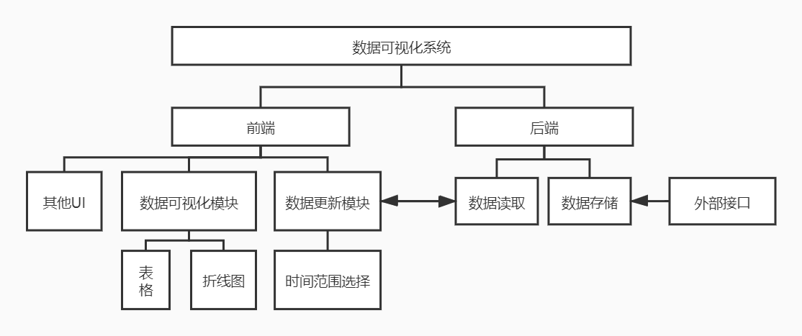

# 系统概要设计

## 系统流程图



## 系统模块划分



## 前后端交互接口

### 描述

获取百度、谷歌、友盟三个统计平台指定日期范围内的pv、uv数据

### 请求

##### 语法

```
get /visualization/getPvuv
```

##### 请求参数

| 参数名    | 必选 | 数据类型 | 说明                       | 示例       |
| :-------- | ---- | -------- | -------------------------- | ---------- |
| startDate | 是   | String   | 开始日期(格式：YYYY-MM-DD) | 2020-08-01 |
| endDate   | 是   | String   | 结束日期(格式：YYYY-MM-DD) | 2020-08-07 |

### 响应

##### 成功响应示例

```js
{
    errno: 0,
    errmsg: "",
    data:[
        {
            date: "2020-08-07",
            baidupv: 2089,
            baiduuv: 670,
            googlepv: 2076,
            googeuv: 680,
            umengpv: 2079,
            umenguv: 678,
        },
        ...
    ]
}
```

##### 响应元素

| 名称     | 数据类型 | 说明                   |
| -------- | -------- | ---------------------- |
| date     | Date     | 日期                   |
| baidupv  | Number   | 对应日期的百度统计pv值 |
| baiduuv  | Number   | 对应日期的百度统计uv值 |
| googlepv | Number   | 对应日期的谷歌统计pv值 |
| googleuv | Number   | 对应日期的谷歌统计uv值 |
| umengpv  | Number   | 对应日期的友盟统计pv值 |
| umenguv  | Number   | 对应日期的友盟统计uv值 |

##### 错误返回示例

所有 errno 不为 0 的返回值都是有错误的，具体错误信息查看 errmsg。

```js
{
    errno: 1,
    errmsg: "参数错误：所选日期范围内没有数据",
    data:[]
}
```

