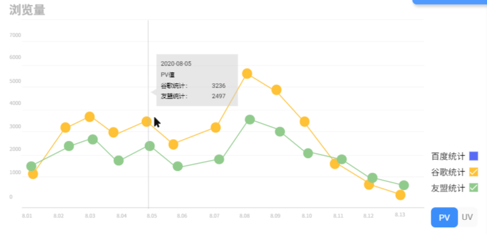
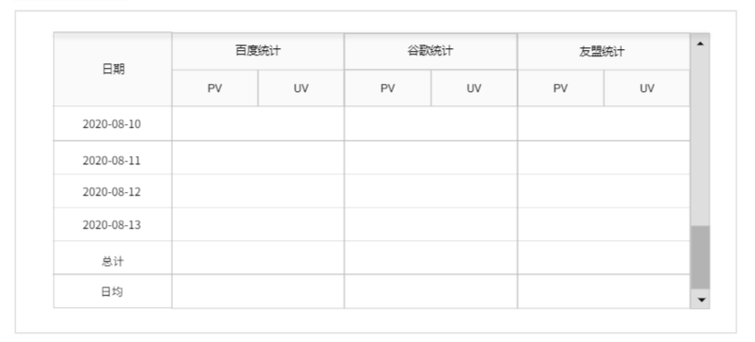
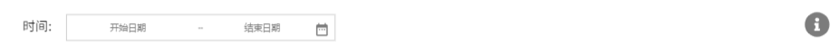

# 详细设计

## 前端

#### 数据可视化模块

##### 描述

数据可视化模块是将数据以图表等形式进行显示的模块。本模块要在网页上实现1个折线图和1个数据汇总表。

##### 界面

> 折线图



> 数据汇总表



##### 输入

| 名称       | 类型    | 输入方式                     | 说明                                               |
| ---------- | ------- | ---------------------------- | -------------------------------------------------- |
| showPv     | Boolean | 折线图右下角switch           | true表示显示PV数据；false表示显示UV数据            |
| showBaidu  | Boolean | 折线图右下角百度统计checkbox | true表示显示百度统计数据的折线图；false表示不显示  |
| showGoogle | Boolean | 折线图右下角谷歌统计checkbox | true表示显示谷歌统计数据的折线图；false表示不显示  |
| showUmeng  | Boolean | 折线图右下角友盟统计checkbox | true表示显示友盟统计数据的折线图；false表示不显示  |
| data       | Array   | 从数据更新模块获取           | 具体数据，见下表                                   |
| state      | Number  | 从数据更新模块获取           | 0 ：正常显示数据；1：数据进行加载；2：数据获取异常 |

`data` 

`正常状态`

| 名称     | 数据类型 | 说明                   |
| -------- | -------- | ---------------------- |
| date     | Date     | 日期                   |
| baidupv  | Number   | 对应日期的百度统计pv值 |
| baiduuv  | Number   | 对应日期的百度统计uv值 |
| googlepv | Number   | 对应日期的谷歌统计pv值 |
| googleuv | Number   | 对应日期的谷歌统计uv值 |
| umengpv  | Number   | 对应日期的友盟统计pv值 |
| umenguv  | Number   | 对应日期的友盟统计uv值 |

##### 输出

`正常状态`

> 折线图

* 横轴坐标文字显示：格式mm-dd，第一项为开始日期，至多显示15个日期

  | 日期涵盖天数 | 横坐标显示                            |
  | ------------ | ------------------------------------- |
  | 2-15         | 全部显示                              |
  | days > 15    | 每隔Math.foor(days -1/ 15) 天进行显示 |

* 纵轴坐标文字显示：以整千为单位，第一项为0，至多显示8个数据文字

* 纵轴标题根据`showPV`显示浏览量/访客数

* 折线上每个数据都以小圆点标识

* 鼠标放置在折线图上时，在横轴距离最近的数据点处显示辅助竖线和文字提示，提示内容：

  * 日期：yyyy-mm-dd
  * PV/UV值
  * 当前显示的平台的各自数据

> 表格

* 固定表头，滚动条显示
* 按时间排序，日期小排序在前
* 最后两行分别为输入数据的总和和日均

`加载状态`

* 不显示折线图，在折线图位置显示文字信息和加载动画
* 保留表格的表头，在表格数据部分显示文字信息和加载动画

`异常状态`

- 不显示折线图，在折线图位置显示文字信息和警告图标
- 保留表格的表头，在表格数据部分显示文字信息和警告图标
- 在页面顶部显示全局提示

##### 实现

* 折线图参考ECharts
* 表格参考360e+ Design

##### 接口

名称：changeData

描述：提供给数据更新模块，用于通知数据可视化模块应发生相应变化

| 参数  | 数据类型 | 说明                                               |
| ----- | -------- | -------------------------------------------------- |
| state | Number   | 0 ：正常显示数据；1：数据进行加载；2：数据获取异常 |
| data  | Array    | 正常时的数据                                       |
| msg   | String   | 异常时的异常信息                                   |


#### 数据更新模块

##### 描述

数据更新模块负责向后端请求数据，获得数据后，通知数据可视化模块进行数据显示。

##### 界面



##### 输入

| 名称      | 类型 | 输入方式   | 说明                                         |
| --------- | ---- | ---------- | -------------------------------------------- |
| startDate | Date | 日期选择器 | 必须早于当日，最早日期限制：统计平台的最早日期 |
| endDate   | Date | 日期选择器 | 必须早于当日                                 |

* 不允许选择单日

##### 输出

* 请求开始时，通知数据可视化模块正在加载
* 获取数据成功时，通知数据可视化模块更新显示
* 获取数据发生异常时，通知数据可视化模块有异常，并且将日期选择器复位。

##### 实现

* 日期选择器参考360e+ Design
* 向后端请求数据的时机：当日期选择器的下拉框隐藏时（用户可能是选择完毕或者取消选择），对比上一次日期选择范围，若发生变化，则向后端请求数据。
* 修改：当日期选择器的日期选择范围发生变化时，向后端请求数据。根据360e+Design的change事件规则，当用户选择日期与上次一致或者取消选择时时，并不会触发change事件，已经满足需求，不需要使用下拉框消失再判断日期是否变化。
* 向数据可视化模块通知的时机：获取后端的响应后，则将异常码转换为对应的状态码，将状态码、数据、信息提供给数据可视化模块。

#### 其他UI

* 侧边导航栏，用于日后可能的功能拓展，目前只开放PV/UV栏
* 内容提示框：多日趋势对比图/多日数据汇总表，用于说明网页分块内容
* 参考360e+ Design

## 后端

#### 数据读取

##### 描述

获取百度、谷歌、友盟三个统计平台指定日期范围内的pv、uv数据

##### 算法

使用数据库内部的排序算法，将数据里的内容按照日期排序，日期小在前。

##### 接口

###### 语法

```
get /visualization/getPvuv 
```

###### 请求参数

| 参数名    | 必选 | 数据类型 | 说明                       | 示例       |
| :-------- | ---- | -------- | -------------------------- | ---------- |
| startDate | 是   | String   | 开始日期(格式：YYYY-MM-DD) | 2020-08-01 |
| endDate   | 是   | String   | 结束日期(格式：YYYY-MM-DD) | 2020-08-07 |

###### 响应

###### 成功响应示例

```js
{
    errno: 0,
    errmsg: "",
    data:[
        {
            date: "2020-08-07",
            baidupv: 2089,
            baiduuv: 670,
            googlepv: 2076,
            googeuv: 680,
            umengpv: 2079,
            umenguv: 678,
        },
        ...
    ]
}
```

###### 响应元素

| 名称     | 数据类型 | 说明                   |
| -------- | -------- | ---------------------- |
| date     | Date     | 日期                   |
| baidupv  | Number   | 对应日期的百度统计pv值 |
| baiduuv  | Number   | 对应日期的百度统计uv值 |
| googlepv | Number   | 对应日期的谷歌统计pv值 |
| googleuv | Number   | 对应日期的谷歌统计uv值 |
| umengpv  | Number   | 对应日期的友盟统计pv值 |
| umenguv  | Number   | 对应日期的友盟统计uv值 |

###### 错误返回示例

所有 errno 不为 0 的返回值都是有错误的，具体错误信息查看 errmsg。

```js
{
    errno: 1,
    errmsg: "参数错误：所选日期范围内没有数据",
    data:[]
}
```

#### 数据存储

##### 描述

​		将网页中三个统计平台统计到的PV、UV数据存储

##### 接口

###### 语法

```
post /visualization/storePvuv 
```

###### 暂无
